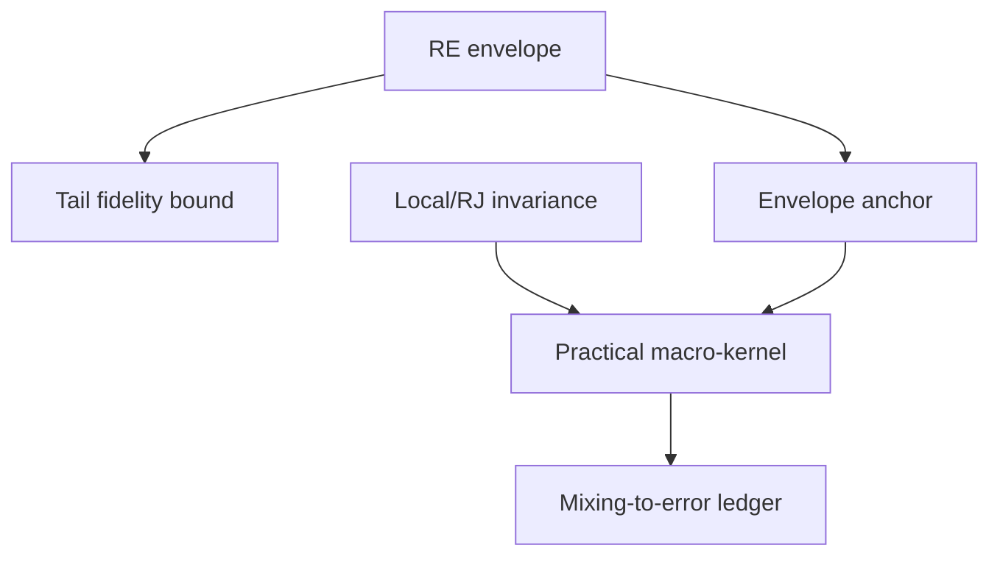

# P3F.4-CERT.2 response-energy tail and anchored-kernel mixing contract

Status: **MATHEMATICAL CONTRACT COMPLETE; IMPLEMENTATION NOT YET AUTHORIZED**

Source baseline: GitHub `main`
`5b05e9158b1a550e967a88a3123f76985346fc8e`

Predecessor decision: `P3F.4-CERT.CF.1` is a permanent formal **NO-GO**.
Six of eight runs passed. Both runs of
`cert_confirmatory_irregular_negative_cubic_af` failed the frozen posterior-tail
ceiling and the derived one-step envelope-proposal bound. This document does
not revise that decision, reuse those responses as confirmation, or authorize a
rerun.

This contract defines the only admissible next certification family. It does
not implement or invoke resident SMC, predictive calibration, real data,
acquisition, held-out state, or efficacy evaluation.

## 1. Diagnosis and correction target

The CERT.1 component-uniform bound was

\[
M_\nu^{\mathrm{flat}}
=(2\pi)^{-\nu/2}
\frac{\Gamma(a_0+\nu/2)}{\Gamma(a_0)}
b_0^{-\nu/2}.
\]

It follows by discarding both the design determinant penalty and the
response-dependent quadratic term. Consequently the final-history tail
evidence upper was exactly `0.0009688196347819108` in all eight confirmatory
runs. When the exact core evidence was small, the same constant created both
reported blockers.

CERT.2 must satisfy two separate objectives:

1. retain a rigorous upper bound while recovering the response energy and the
   unavoidable determinant--fit trade-off; and
2. distinguish the posterior-tail fidelity decision from structural validity
   and mixing of the actual practical Markov kernel.

The raw countably open target, semantic multiplicities, operational estimand,
and the registered `0.01` tail and TV tolerances remain unchanged.

## 2. Frozen target assumptions

For one collapsed spike or discrepancy component, let

- \(W=\operatorname{diag}(\lambda_1,\ldots,\lambda_n)\), with every
  \(\lambda_i\ge0\);
- \(\nu=\sum_i\lambda_i\), including fractional bridge powers and the
  powers above one used by the second-moment calculation;
- \(X\) be the component design;
- \(\Lambda\succ0\) be its registered coefficient/discrepancy prior
  precision;
- \(\theta\mid\sigma^2\sim N(0,\sigma^2\Lambda^{-1})\); and
- \(\sigma^2\sim\operatorname{IG}(a_0,b_0)\).

The zero prior mean is an explicit assumption of the current target, not a
silent generalization. The frozen values are \(a_0=3\) and \(b_0=0.08\).
A future nonzero prior mean requires a new response-independent recentering
proof or fails closed.

Define

\[
u=W^{1/2}y,
\qquad
R_\lambda=u^\top u=\sum_i\lambda_i y_i^2,
\qquad
c_\nu=a_0+\nu/2,
\]

and

\[
V_X=I+W^{1/2}X\Lambda^{-1}X^\top W^{1/2}\succeq I.
\]

The spike and every registered discrepancy state satisfy these assumptions.
Mixture weights over discrepancy states sum to one, so a component-uniform
bound also bounds their mixture.

## 3. Theorem RE-1: sharp design-uniform response-energy envelope

### Statement

The weighted collapsed marginal likelihood is

\[
m_\lambda(X;y)
=A_\nu |V_X|^{-1/2}
\left(b_0+\frac12u^\top V_X^{-1}u\right)^{-c_\nu},
\]

where

\[
A_\nu=(2\pi)^{-\nu/2}
\frac{\Gamma(c_\nu)}{\Gamma(a_0)}b_0^{a_0}.
\]

Let \(R=R_\lambda\). If \(R=0\), set \(t_\star=1\). Otherwise set

\[
t_\star
=\min\left\{
1,
\frac{b_0}{(c_\nu-1/2)R}
\right\}.
\]

Because \(a_0=3\) and \(\nu\ge0\), \(c_\nu-1/2>0\). Then, for every
registered component design,

\[
m_\lambda(X;y)
\le
M_\lambda^{\mathrm{RE}}(y)
:=A_\nu\sqrt{t_\star}
\left(b_0+\frac12R t_\star\right)^{-c_\nu}.
\]

This is the exact supremum over the larger class of all matrices
\(V\succeq I\). It is therefore a valid, potentially conservative bound for
the registered design family without enumerating a tail AST.

### Proof

Integrating the zero-mean Gaussian coefficient prior and using the matrix
determinant lemma gives the displayed marginal-likelihood identity. Put
\(H=V^{-1}\), so \(0\prec H\preceq I\). For \(R>0\), let
\(e=u/\sqrt R\) and \(t=e^\top H e\in(0,1]\).

In an orthonormal basis whose first vector is \(e\), write

\[
H=\begin{pmatrix}t&h^\top\\h&B\end{pmatrix}.
\]

The Schur complement and \(H\preceq I\) imply

\[
|H|=|B|(t-h^\top B^{-1}h)\le |B|t\le t.
\]

Also \(u^\top H u=Rt\). Hence

\[
|V|^{-1/2}
\left(b_0+\frac12u^\top V^{-1}u\right)^{-c_\nu}
\le
\sqrt t\left(b_0+\frac12Rt\right)^{-c_\nu}.
\]

The derivative of the right-hand log expression is

\[
\frac{1}{2t}
-\frac{c_\nu R/2}{b_0+Rt/2}.
\]

Its unconstrained zero is
\(t=b_0/((c_\nu-1/2)R)\); restricting to \((0,1]\) gives
\(t_\star\). Equality over the enlarged covariance class is obtained by
choosing \(H\) with eigenvalue \(t_\star\) in direction \(e\) and eigenvalue
one in every orthogonal direction. For \(R=0\), determinant monotonicity gives
the maximum at \(H=I\). This proves the theorem.

### Dominance over CERT.1

For every non-negative power vector,

\[
M_\lambda^{\mathrm{RE}}(y)
\le M_\nu^{\mathrm{flat}},
\]

because \(\sqrt t\le1\) and
\(b_0+Rt/2\ge b_0\). Equality is possible at zero response energy. Thus
replacing the old bound cannot weaken any normalizer or bridge certificate.

## 4. Theorem RE-2: response-valid posterior-tail certificate

Let the exact semantic quotient cover all raw AST sizes through \(J\), and let
\(Z_{J,\lambda}(y)\) be its unnormalized evidence under the original raw-AST
prior mass. The unresolved grammar prior mass is \(\rho^J\). Theorem RE-1
gives

\[
Z_{>J,\lambda}(y)
\le U_{J,\lambda}^{\mathrm{RE}}(y)
:=\rho^J M_\lambda^{\mathrm{RE}}(y).
\]

Therefore

\[
\tau_{J,\lambda}(y)
=\Pr(|S|>J\mid y,\lambda)
\le
\overline\tau_{J,\lambda}^{\mathrm{RE}}(y)
:=\frac{U_{J,\lambda}^{\mathrm{RE}}(y)}
{Z_{J,\lambda}(y)+U_{J,\lambda}^{\mathrm{RE}}(y)}.
\]

For every registered \(0\le\varphi\le1\),

\[
|\pi_\infty(\varphi)-\pi_J(\varphi)|
\le\overline\tau_{J,\lambda}^{\mathrm{RE}}.
\]

This includes operational-class probabilities and predictive-CDF
coordinates. It does not automatically bound pointwise predictive density.

### Optional exact-shell escalation

If a fixed \(J\) fails, an implementation may evaluate additional semantic
shells through \(K>J\) and replace the residual by

\[
U_{K,\lambda}^{\mathrm{RE}}=\rho^K M_\lambda^{\mathrm{RE}}.
\]

The allowed cutoff sequence, maximum semantic cells, memory ceiling, and
fail-closed stopping rule must be frozen before new responses. The smallest
certifying cutoff may be selected by that deterministic rule. Failure to
certify within the frozen budget is NO-GO. A response-specific manual cutoff
is forbidden.

## 5. Consequence for the certified bridge path

CERT.1 used

\[
\underline r_J(\beta,\beta')
=\frac{Z_{J,\beta'}^2}
{\overline Z_{J,\beta}\overline Z_{J,2\beta'-\beta}}.
\]

The RE envelope weakly decreases each upper normalizer while leaving every
exact core numerator unchanged. Hence every RE relative-ESS lower bound is at
least its CERT.1 value. All previously certified bridge steps remain valid,
but a new implementation must recompute and record the RE values; it may not
copy the old summaries.

The formula is valid when \(2\beta'-\beta>1\), because Theorem RE-1 only
requires non-negative likelihood powers.

## 6. Mixing is a dependency graph, not a duplicated Gate

The CERT.1 envelope independence proposal used the same tail upper to derive
both tail fidelity and global refresh minorization. Therefore a failed tail
certificate necessarily appeared a second time as a failed proposal-mixing
decision. CERT.2 records that dependence explicitly:

If the RE envelope is invalid, both descendants fail. If the tail threshold
fails, the mixing result is recorded as `blocked_by_tail_certificate`, not as
a second independent scientific blocker.

## 7. Theorem MK-1: normalized envelope anchor

Let

\[
C_{J,\lambda}^{\mathrm{RE}}
=Z_{J,\lambda}+U_{J,\lambda}^{\mathrm{RE}}.
\]

Define an independence proposal on the hybrid semantic-core/raw-tail space:

\[
q_E(z)=
\begin{cases}
\gamma_\lambda(z)/C_{J,\lambda}^{\mathrm{RE}},&z\in\mathcal C_J,\\
p(z)M_\lambda^{\mathrm{RE}}/C_{J,\lambda}^{\mathrm{RE}},&z\notin\mathcal C_J.
\end{cases}
\]

It is exactly normalized. The tail draw uses the conditional geometric size
law and the exact raw-AST prior sampler; it may not use a finite support
fallback. Independence-MH correction leaves the full open target invariant.
Moreover,

\[
q_E(z)\ge\epsilon_E\pi_\lambda(z),
\qquad
\epsilon_E\ge
\underline\epsilon_E
:=\frac{Z_{J,\lambda}}
{Z_{J,\lambda}+U_{J,\lambda}^{\mathrm{RE}}}
=1-\overline\tau_{J,\lambda}^{\mathrm{RE}}.
\]

The independence kernel \(E_\lambda\) therefore satisfies

\[
E_\lambda(x,\cdot)\ge\underline\epsilon_E\pi_\lambda(\cdot).
\]

This is the independent-Hastings domination condition of Mengersen and
Tweedie (1996).

## 8. Theorem MK-2: practical anchored local/RJ kernel

Let \(L_{\lambda,1},\ldots,L_{\lambda,r}\) be practical local, semantic, or
trans-dimensional kernels. Each must separately prove

\[
\pi_\lambda L_{\lambda,j}=\pi_\lambda,
\]

including exact forward/reverse proposal probabilities, full bidirectional
support, and any Jacobian. No learned or heuristic proposal is exempt.

For any fixed composition containing one envelope anchor,

\[
K_\lambda
=L_{\lambda,r_2}\cdots L_{\lambda,1}
E_\lambda
L_{\lambda,-1}\cdots L_{\lambda,-r_1},
\]

invariance of the local kernels implies

\[
K_\lambda(x,\cdot)
\ge\underline\epsilon_E\pi_\lambda(\cdot).
\]

Thus, after \(m\) registered macro-sweeps,

\[
\sup_x\|K_\lambda^m(x,\cdot)-\pi_\lambda\|_{\mathrm{TV}}
\le(1-\underline\epsilon_E)^m.
\]

Local moves may improve practical exploration without weakening this global
bound. The order and count of local moves are part of the kernel identity and
compute ledger.

For a random-scan implementation
\(K_\eta=\eta E+(1-\eta)L\), the weaker bound is

\[
\sup_x\|K_\eta^m(x,\cdot)-\pi_\lambda\|_{\mathrm{TV}}
\le(1-\eta\underline\epsilon_E)^m.
\]

The anchor probability \(\eta\), if used, must be frozen before response
access. It cannot be selected from acceptance or confirmatory results.

The minorization basis follows Mengersen and Tweedie,
<https://doi.org/10.1214/aos/1033066201>. Its role in finite-sample SMC error
must later be composed with the particle budget rather than replaced by ESS;
see Marion, Mathews, and Schmidler,
<https://arxiv.org/abs/1803.09365>. Controlled or learned proposals are future
efficiency extensions only and must remain exactly corrected; see Heng et al.,
<https://arxiv.org/abs/1708.08396>.

## 9. Registered CERT.2 Gate

| ID | Obligation | Fail-closed decision |
|---|---|---|
| RE0 | Source, target, prior and response-role hashes are complete | Any mismatch is NO-GO |
| RE1 | Weighted collapsed identity agrees with the existing target | Any algebra or numerical mismatch is NO-GO |
| RE2 | Every tested component is below the RE envelope with registered tolerance | Any violation is NO-GO |
| RE3 | Exact semantic core conserves raw prior mass | Error above `2e-12` is NO-GO |
| RE4 | Final posterior-tail upper is at most `0.01` | Exceedance is NO-GO |
| BR1 | Every bridge reaches one with RE relative-ESS lower at least `0.8` | Forced or uncertified step is NO-GO |
| MK0 | Envelope anchor is normalized and samples the countably open tail | Finite fallback is NO-GO |
| MK1 | Every local/RJ kernel proves target invariance | Missing ratio/support/Jacobian is NO-GO |
| MK2 | Frozen macro-kernel gives TV at most `0.01` within its registered sweep budget | Failure is NO-GO |
| PV0 | Git commit, runner/config hashes, dependency lock and fixed interpreter are recorded | Missing provenance is NO-GO for a positive claim |

RE4 and MK2 are not counted as independent evidence when MK2 uses the RE4
anchor. The result must expose a dependency field and one root blocker.

The old `mixing_steps_maximum=1` result remains frozen and failed. A CERT.2
implementation may retain one anchor macro-sweep, or preregister a different
compute-derived sweep budget before new responses; it may not relabel the old
run. The TV tolerance remains `0.01`.

## 10. Evidence roles and authorization boundary

The failed AF--AI confirmatory responses may be used only for postmortem
development checks of implementation correctness. They cannot be used to
choose thresholds, cutoff limits, anchor frequency, local moves, or a new
confirmatory bank.

The legal sequence after review of this document is:

1. implement the RE envelope and dependency-aware certificate as a static
   development layer;
2. prove exact agreement with the old marginal likelihood on finite semantic
   components and run response-free/unit correctness checks;
3. use the already opened AF--AI responses only as labelled postmortem
   development diagnostics;
4. freeze a completely new response-free confirmatory bank and complete
   provenance before materialization; and
5. only after an unseen pass, review a resident-SMC integration contract.

Until then:

- resident-SMC implementation: blocked;
- predictive calibration: blocked;
- real data and acquisition: blocked;
- held-out: closed;
- efficacy and paper-level superiority claims: unauthorized.
